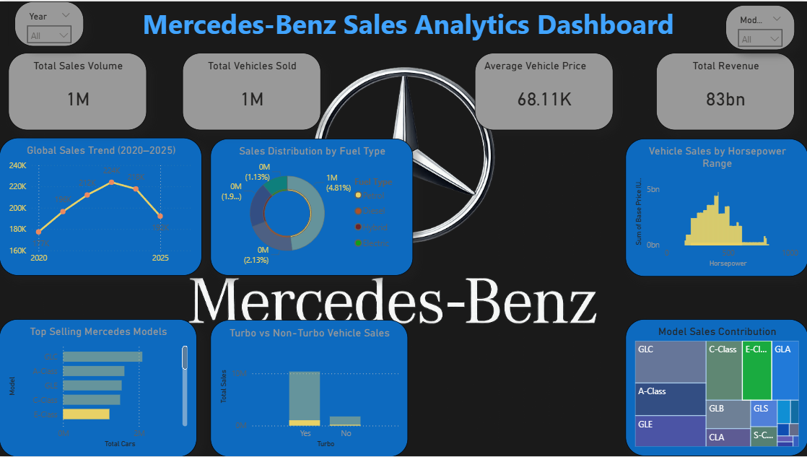

# Mercedes-Benz Sales Analytics Dashboard

## Project Overview
This project analyzes Mercedes-Benz vehicle sales using SQL, Python, and Power BI.

## Tools Used
- SQL Server
- Python (Pandas)
- Power BI

## Dataset Columns
- Model
- Year
- Region
- Fuel Type
- Horsepower
- Sales Volume
- Revenue

## Key Insights
• Total Revenue: 83 Billion
• Average Vehicle Price: 68.11K
• Top Selling Model: GLC
• Petrol vehicles dominate sales

## Files in This Project
mercedes_benz_sales_dataset.csv – dataset  
mercedes_benz_sql_queries.sql – SQL queries  
mercedes_benz_sales_analysis.ipynb – Python analysis  
mercedes_benz_sales_dashboard.pbix – Power BI dashboard  

mercedes_benz_dashboard_preview.png – dashboard image

## Key Insights

- Total Revenue: **83 Billion**
- Average Vehicle Price: **68.11K**
- Top Selling Model: **GLC**
- Petrol vehicles dominate vehicle sales

- ## Project Structure

- `mercedes_benz_sales_analysis.ipynb` → Python data analysis
- `mercedes_benz_sql_queries.sql` → SQL queries used for analysis
- `mercedes_benz_dashboard_preview.png` → Dashboard screenshot
- `README.md` → Project documentation
